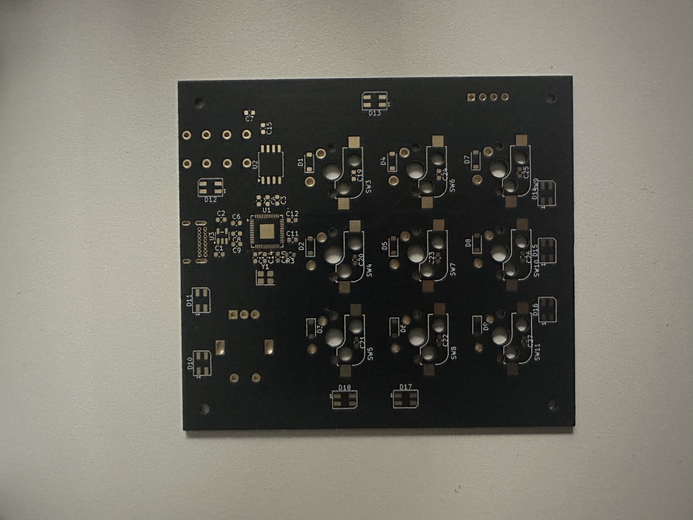
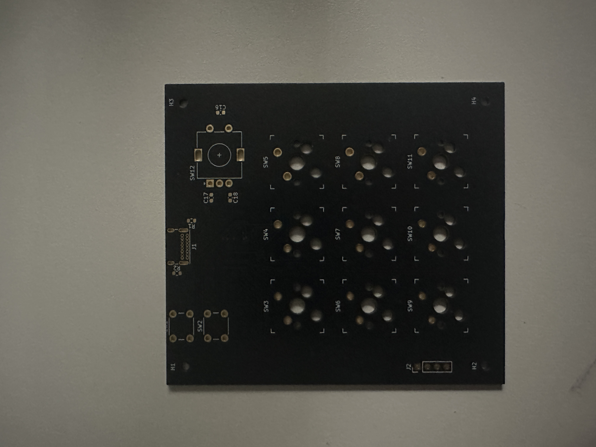

# Macro Keypad — Custom USB Mechanical Keypad (KiCad)

A custom 9-key (3×3) USB-C mechanical macro keypad, designed from schematic to
fabrication in KiCad around an **RP2040** microcontroller. This is my own design —
schematic capture, component selection, PCB layout, and fabrication.

## The fabricated board

| Top | Bottom |
| --- | --- |
|  |  |

*Bare 2-layer board from JLCPCB, prior to switch/component assembly.*

## Design highlights

- **RP2040** microcontroller with USB-C for both power and data
- **USBLC6** ESD protection on the USB data lines
- **3×3 matrix of 9 mechanical key switches**, each with a per-key diode for N-key
  rollover / anti-ghosting during matrix scanning
- Decoupling on each supply pin; crystal and supporting passives per the RP2040
  reference design
- **2-layer PCB**, board outline defined in Edge.Cuts, ERC/DRC clean
- Gerbers + drill files generated and **fabricated through JLCPCB**

## What's in this repo

- `macro-keypad.kicad_sch` / `.kicad_pcb` / `.kicad_pro` — the KiCad project
- `macro-keypad.pdf` — schematic PDF
- `gerbers/` — fabrication outputs
- `board-front.jpg` / `board-back.jpg` — photos of the fabricated board

## Status — in progress

Bare fabricated board is in hand. Currently:

- **Hand-soldering** the switches, per-key diodes, and supporting components onto the board
- **Writing the RP2040 firmware** — USB-HID keyboard with matrix scanning and debounce

Next up: bring-up and testing once assembly is complete.

## Tools

KiCad · JLCPCB
